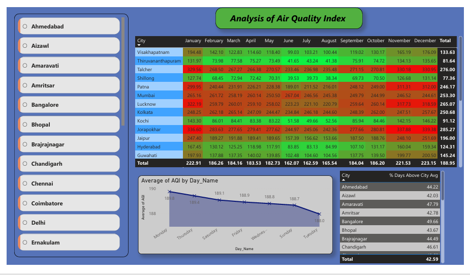
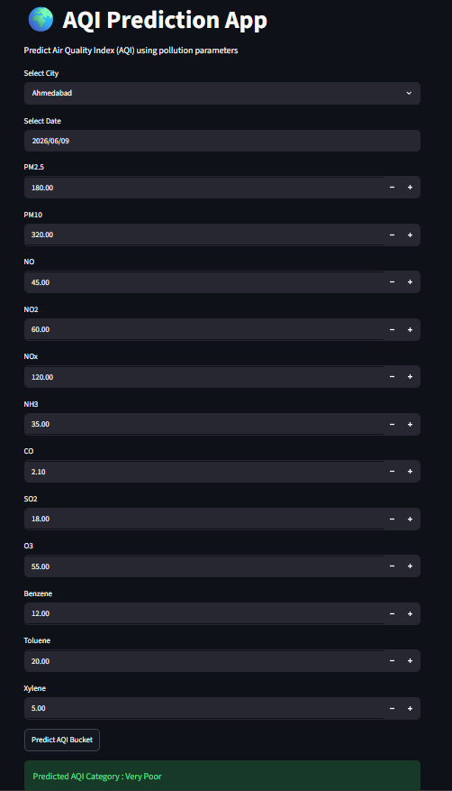

# 🌍 Air Quality Intelligence Analytics, Visualization and Prediction

## 📌 Project Overview

This project develops an end-to-end Data Analytics and Machine Learning solution to analyze air quality trends across major Indian cities, identify key pollution drivers, and predict Air Quality Index (AQI) categories. The project combines data preprocessing, exploratory data analysis (EDA), Power BI dashboard development, machine learning model building, and Streamlit deployment.

### 🎯 Objective

Analyze air pollution patterns and predict AQI categories using environmental pollutant data.

### 🎯 Target Variable

**AQI_Bucket** (Categorical Variable)

Categories:

* Good
* Satisfactory
* Moderate
* Poor
* Very Poor
* Severe

---

# 📊 Power BI Dashboard

## Dashboard 1 – AQI Trend Analysis



### Dashboard Features

* Monthly AQI Heatmap
* Day-wise AQI Analysis
* City Performance Comparison
* Percentage of Days Above City Average AQI
* Seasonal Pollution Trend Analysis

---

## Dashboard 2 – AQI Distribution & Insights


### Dashboard Features

* AQI by City Map Visualization
* AQI Bucket Distribution
* AQI vs PM2.5 Relationship
* Year-wise AQI Trend Analysis
* Most Polluted City Identification
* KPI Cards for Average AQI and Maximum AQI

---

# 📊 Results & Key Findings

## Air Quality Trends

* The overall average AQI across analyzed cities was approximately **189**, indicating that air quality frequently falls within the **Moderate to Poor** category.
* AQI showed clear seasonal variation, with pollution generally increasing during winter months and improving during monsoon periods.
* Multiple cities consistently recorded AQI levels above the national average, highlighting persistent pollution concerns.

## City-Level Insights

* **Jorapokhar** emerged as one of the most polluted cities in the dataset.
* Cities such as **Talcher, Lucknow, Patna, and Delhi** frequently recorded high AQI levels.
* The percentage of days above city-average AQI varied significantly across cities, indicating differences in industrial activity, traffic density, and environmental conditions.

## Pollutant Analysis

* **PM2.5** and **PM10** were identified as the strongest contributors to AQI.
* Higher concentrations of **NOx** and **NO₂** were associated with elevated AQI levels.
* Correlation analysis showed particulate matter has a stronger influence on AQI fluctuations than most gaseous pollutants.

## AQI Category Distribution

* The **Moderate** category represented the largest proportion of observations.
* A significant number of records belonged to the **Poor** and **Very Poor** categories.
* The **Good** AQI category accounted for only a small percentage of observations.

## Environmental Implications

* Controlling particulate matter emissions from vehicles, construction sites, and industrial activities can significantly improve air quality.
* Continuous monitoring and predictive analytics can help identify pollution hotspots and support data-driven environmental policies.

---

# 📊 Dataset Information

The dataset contains air quality measurements collected from multiple Indian cities between 2015 and 2025.

### Features Included

* City
* Date
* PM2.5
* PM10
* NO
* NO₂
* NOx
* NH₃
* CO
* SO₂
* O₃
* Benzene
* Toluene
* Xylene
* AQI
* AQI Bucket

### Data Source

* data.gov.in
* Central Pollution Control Board (CPCB)

---

# 🔧 Data Preprocessing

### Data Integration

* Merged historical AQI datasets from multiple years into a unified dataset.

### Missing Value Treatment

* Handled missing values using appropriate statistical imputation techniques.

### Duplicate Removal

* Removed duplicate observations to improve data quality.

### Feature Engineering

Extracted date-based features:

* Year
* Month
* Weekday
* Month Name
* Day Name

### Categorical Encoding

Applied One-Hot Encoding for city information.

### Feature Scaling

Applied StandardScaler to numerical features before model training.

---

# 📈 Exploratory Data Analysis (EDA)

Performed extensive analysis to understand pollution trends across India.

### Analysis Performed

* AQI Distribution Analysis
* City-wise AQI Comparison
* Monthly Trend Analysis
* Seasonal Trend Analysis
* AQI Bucket Distribution
* Pollutant Correlation Analysis
* PM2.5 and AQI Relationship Analysis

---

# 🤖 Machine Learning Models

The following models were evaluated for AQI category prediction:

| Model               | Purpose                       |
| ------------------- | ----------------------------- |
| Logistic Regression | Baseline Classification Model |
| Decision Tree       | Rule-Based Classification     |
| Random Forest       | Final Selected Model          |

## Best Model

### Random Forest Classifier

Reasons for Selection:

* Strong classification performance
* Handles non-linear relationships effectively
* Robust to noise and outliers
* Better generalization on unseen data

---

# 🔍 Feature Importance Analysis

Top factors affecting AQI:

1. PM2.5
2. PM10
3. NOx
4. NO₂
5. CO

### Key Insight

Particulate matter (PM2.5 and PM10) emerged as the dominant drivers of poor air quality across Indian cities.

---

# 🌐 Streamlit Application



### Live Demo

🔗 https://air-quality-intelligence-analytics-visualization-and-predictio.streamlit.app/

### Features

- Real-time AQI Category Prediction
- User-friendly input interface
- Automated preprocessing pipeline
- City-wise AQI prediction
- Machine Learning powered classification

# 📂 Project Structure

```text
AIR-QUALITY-INTELLIGENCE-ANALYTICS-VISUALIZATION-AND-PREDICTION/
│
├── Data/
│   ├── AQI_DATA.csv
│   ├── AQI_DATA_2021-2025.csv
│   └── AQI_FINAL_DATA.csv
│
├── Models/
│   ├── aqi_model.pkl
│   ├── city_encoder.pkl
│   ├── scaler.pkl
│   └── model_columns.pkl
│
├── Screenshots/
│   ├── Dashboard_Page1.png
│   ├── Dashboard_Page2.png
│   └── Streamlit_App.png
│
├── AQI_Analysis.ipynb
├── prediction.ipynb
├── app.py
├── requirements.txt
├── README.md
```

---

# 🛠 Technologies Used

* Python
* Pandas
* NumPy
* Matplotlib
* Seaborn
* Scikit-Learn
* Joblib
* Power BI
* Streamlit
* GitHub

---

# 📌 Key Highlights

* Analyzed multi-city air quality data across India.
* Performed extensive data cleaning and feature engineering.
* Developed interactive Power BI dashboards for pollution monitoring.
* Built Machine Learning models for AQI category prediction.
* Identified PM2.5, PM10, and NOx as major pollution drivers.
* Created a Streamlit application for real-time AQI prediction.
* Delivered actionable environmental insights through analytics and visualization.

---

# 🌱 Conclusion

This project demonstrates how data analytics, visualization, and machine learning can be combined to monitor environmental conditions and support data-driven decision-making. The developed solution helps identify pollution patterns, understand key factors affecting air quality, and predict AQI categories for improved environmental awareness and planning.
